# IRCTC-like Railway Management System

A Django-based API for railway ticket booking system with real-time seat availability and booking management.

## Features
1. **User Authentication**
   - User registration and login with token-based authentication
2. **Admin Management**
   - Add/Manage trains with protected API endpoints
3. **Real-time Operations**
   - Check seat availability between stations
   - Book tickets with race condition handling
4. **Security**
   - Role-based access control (Admin/User)
   - API key protection for admin endpoints

## Technology Stack
- **Backend**: Django REST Framework
- **Database**: PostgreSQL
- **Authentication**: Token Authentication
- **Concurrency Control**: Database-level locking

## Setup Instructions

### Prerequisites
- Python 3.8+
- PostgreSQL
- Django 4.2+

### Installation
1. Clone repository:
   ```bash
   git clone https://github.com/gouravpandey009/irctc_booking
   cd irctc_project
   ```

2. Create virtual environment:
   ```bash
   python -m venv venv
   source venv/bin/activate
   ```

3. Install dependencies:
   ```bash
   pip install -r requirements.txt
   ```

4. Database setup:
   - Create PostgreSQL database named `irctc_db`
   - Update `.env` file with database credentials:
     ```env
     DB_NAME=irctc_db
     DB_USER=irctc
     DB_PASSWORD=your_password
     SECRET_KEY=your_secret_key
     ADMIN_API_KEY=super-secret-admin-key
     ```

5. Run migrations:
   ```bash
   python manage.py migrate
   ```

6. Create superuser:
   ```bash
   python manage.py createsuperuser
   ```

7. Start server:
   ```bash
   python manage.py runserver
   ```

## API Documentation

### Endpoints
| Endpoint | Method | Description | Authentication |
|----------|--------|-------------|----------------|
| `/register/` | POST | User registration | None |
| `/login/` | POST | Get auth token | None |
| `/trains/` | POST | Add new train | Admin API Key |
| `/availability/` | GET | Check seat availability | None |
| `/book/<train_id>/` | POST | Book seat | User Token |
| `/booking/<booking_id>/` | GET | Get booking details | User Token |

### Sample Requests
**Add Train (Admin):**
```bash
curl -X POST http://localhost:8000/trains/ \
     -H "X-API-KEY: super-secret-admin-key" \
     -H "Content-Type: application/json" \
     -d '{"source": "Mumbai", "destination": "Delhi", "total_seats": 50}'
```

**Book Seat (User):**
```bash
curl -X POST http://localhost:8000/book/1/ \
     -H "Authorization: Token <user_token>"
```

## Screenshots
1. Postman API Testing  
   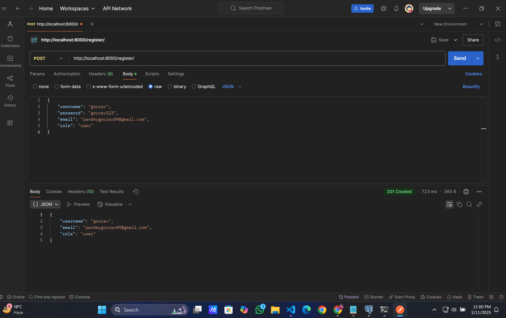
   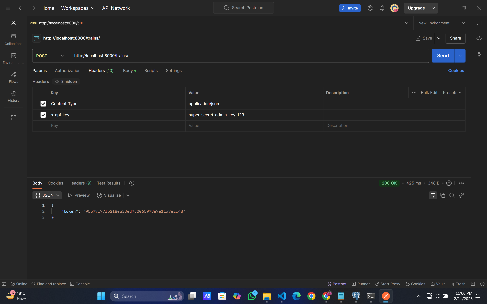
   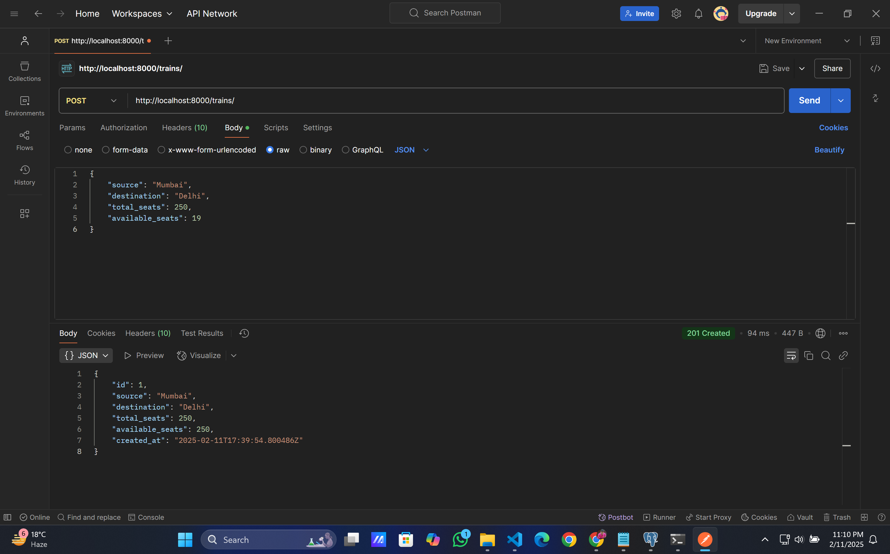
   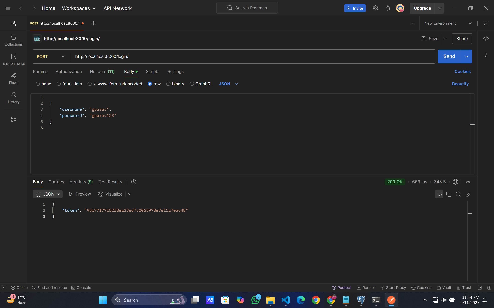
   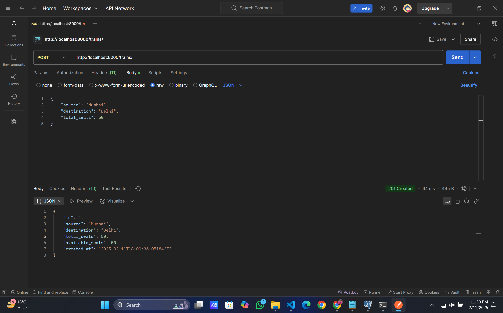
   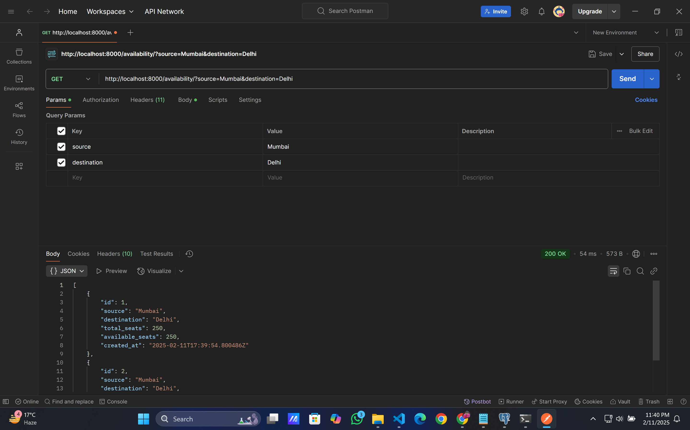
   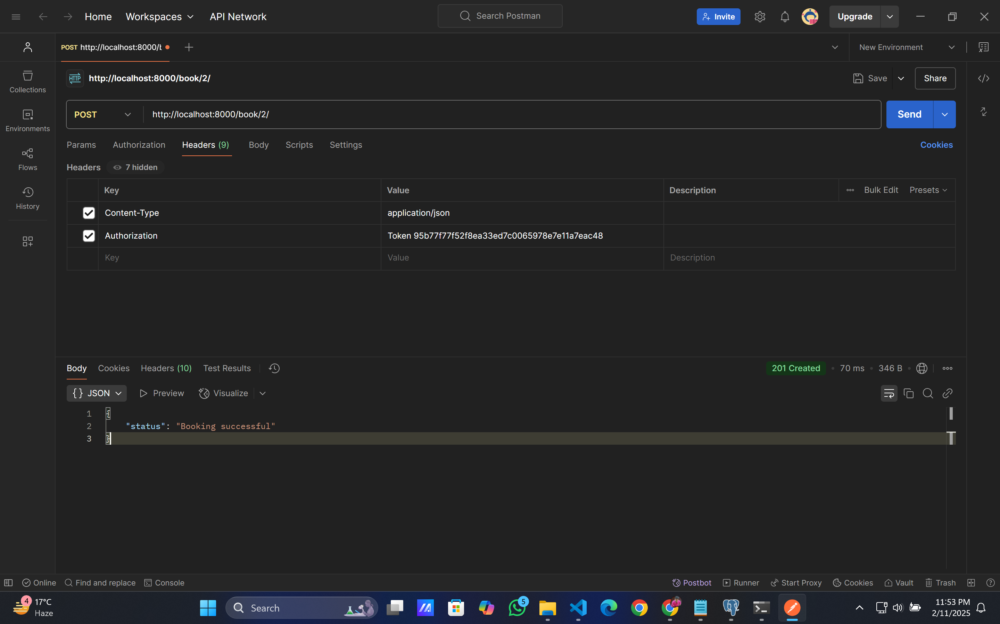

2. Database Screenshots
   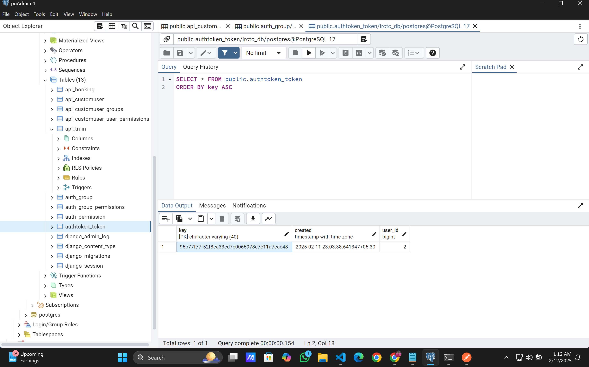
   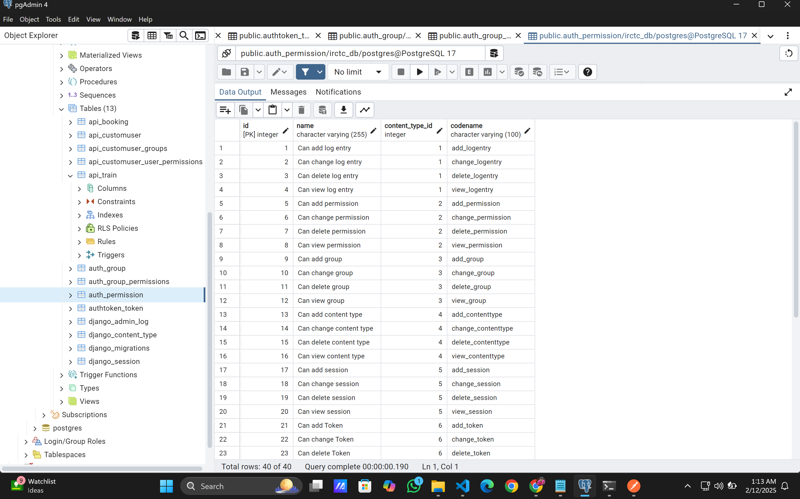
   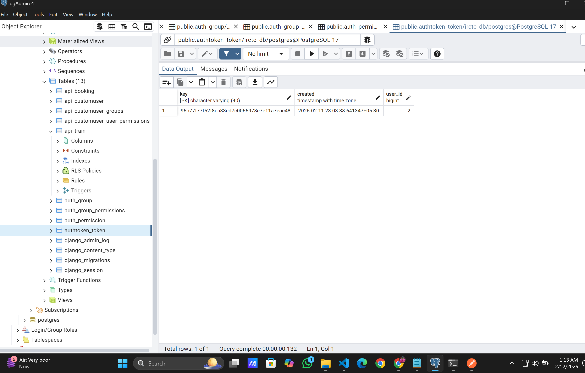
   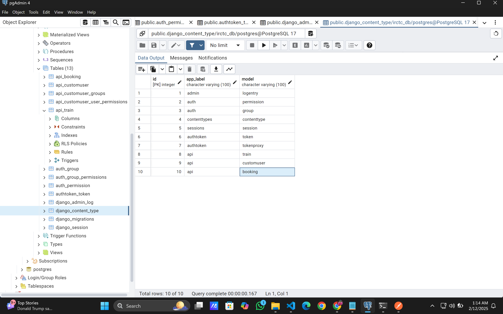
   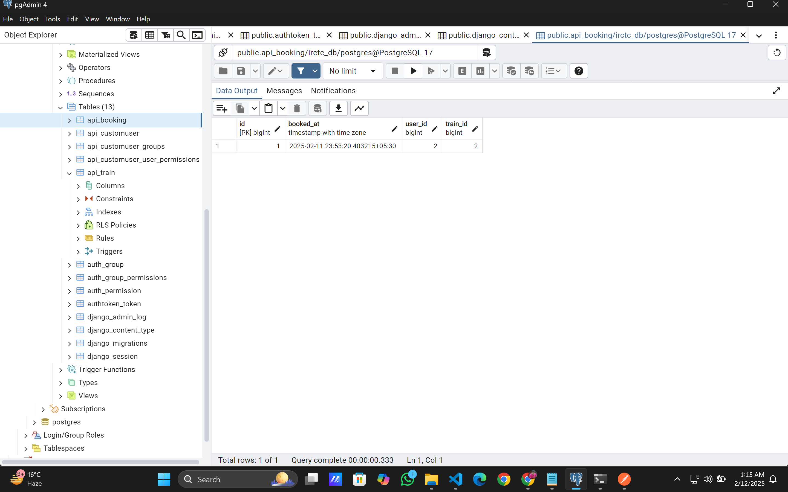
   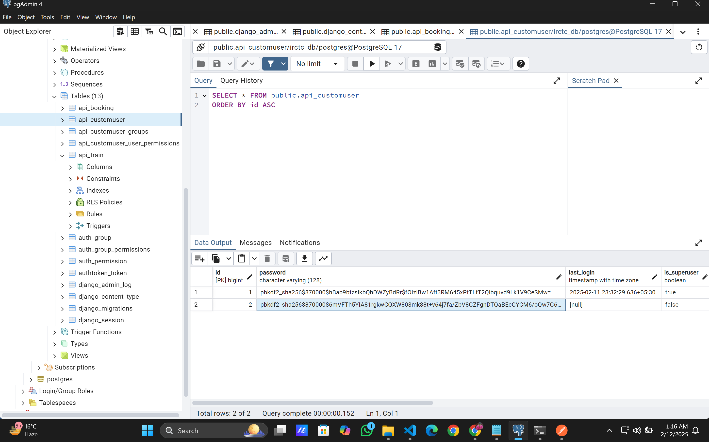
   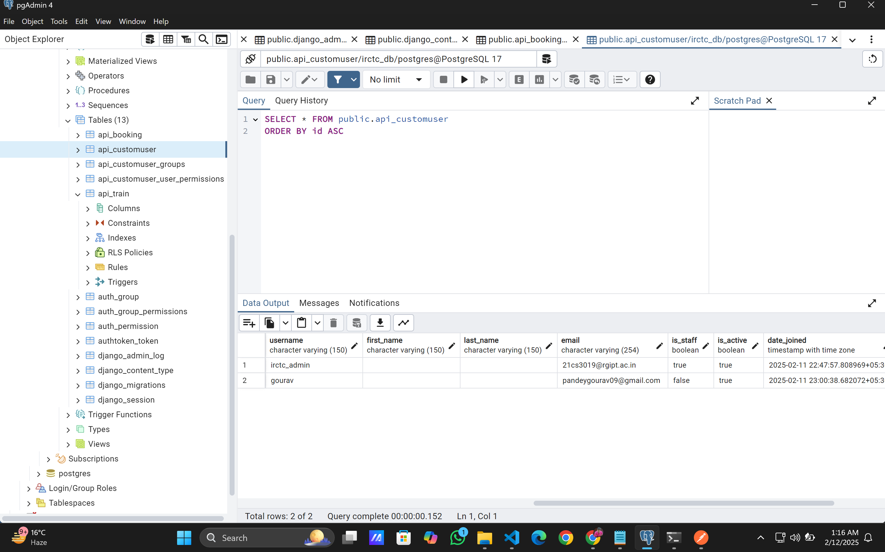
   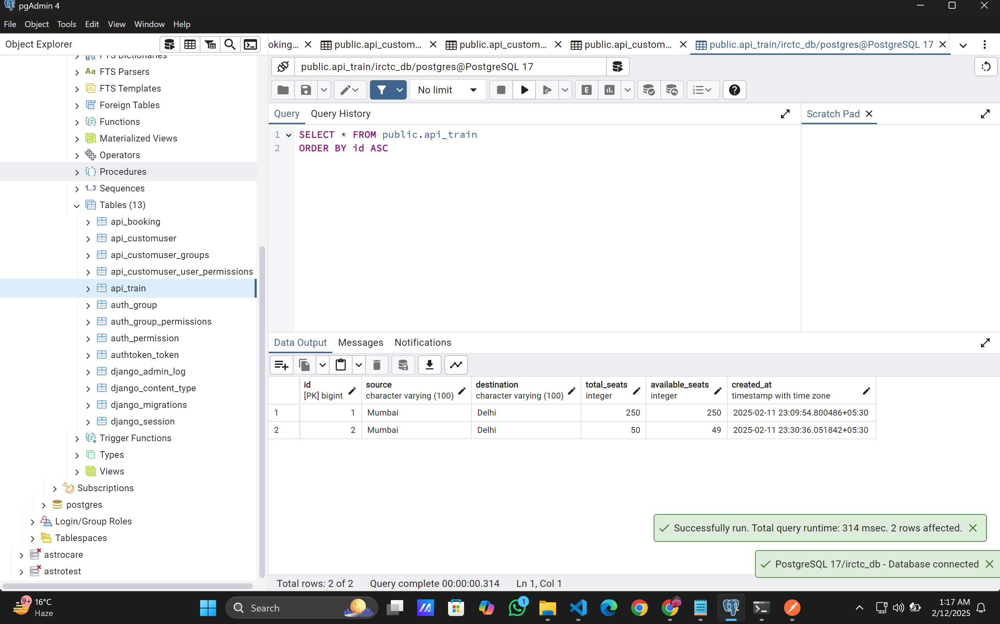


## Implementation Details

### Key Features Implemented
- **Concurrency Control**: Database locking (`select_for_update`) for seat booking
- **Authentication**: 
  - Admin: API key validation
  - Users: Token authentication
- **Validation**: Case-insensitive station search
- **Security**: Environment variables for sensitive data

### Assumptions
1. Trains operate on direct routes between two stations
2. Seat availability is calculated for entire train route
3. One seat per booking request
4. Admin API key is stored in environment variables

## Requirements Completions
1. User registration & login  
2. Admin train management  
3. Seat availability check  
4. Seat booking with concurrency control  
5. Booking details retrieval  
6. API key protection for admin endpoints  
7. Token authentication for user endpoints  
8. PostgreSQL database implementation  


